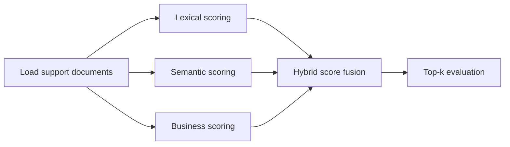

# hybrid-ranking-support-search

## Português

`hybrid-ranking-support-search` é um projeto de busca para bases de suporte que demonstra como **estratégias de ranking híbrido** podem melhorar a ordenação dos resultados. Em vez de depender de um único score, o pipeline combina sinais textuais e sinais operacionais para decidir qual documento deve aparecer primeiro.

### Storytelling técnico

Em ambientes de suporte, a pergunta do usuário quase nunca chega igual ao texto do artigo correto. Um colaborador pode escrever “duplicated payment refund”, enquanto a base interna foi escrita como “billing refund workflow”. Em outro cenário, dois artigos podem ser semanticamente parecidos, mas um deles é mais confiável, mais usado ou mais importante para a operação.

É justamente aí que entra o ranking híbrido. A ideia é simples:

- usar um **sinal lexical** para capturar correspondência textual;
- usar um **sinal semântico** para ampliar cobertura;
- usar **sinais de negócio** para ordenar melhor o que já parece relevante.

O valor deste projeto está em mostrar essa arquitetura de forma pequena, reproduzível e fácil de evoluir.

### O que o projeto faz

O pipeline:

1. gera uma base sintética de documentos de suporte;
2. gera um conjunto de queries com documento relevante conhecido;
3. calcula múltiplos scores por documento;
4. faz a fusão desses sinais em um `hybrid_score`;
5. ordena os documentos;
6. mede se o documento correto ficou no topo com `Hit Rate@1`.

### Por que usar ranking híbrido

Um mecanismo de busca baseado só em palavras exatas costuma falhar quando há:

- paráfrase;
- vocabulário diferente entre usuário e base;
- múltiplos documentos com conteúdo parecido;
- necessidade de priorizar conteúdo mais confiável.

Já um mecanismo puramente semântico pode recuperar itens amplamente relacionados, mas nem sempre priorizar o artigo operacionalmente mais útil. O ranking híbrido existe para equilibrar esses mundos.

### Arquitetura do projeto

- [src/sample_data.py](/Users/flaviagaia/Documents/CV_FLAVIA_CODEX/hybrid-ranking-support-search/src/sample_data.py)  
  Gera o dataset bruto de documentos e queries de avaliação.
- [src/modeling.py](/Users/flaviagaia/Documents/CV_FLAVIA_CODEX/hybrid-ranking-support-search/src/modeling.py)  
  Calcula os scores, normaliza os sinais, faz a fusão híbrida e mede a qualidade do topo do ranking.
- [main.py](/Users/flaviagaia/Documents/CV_FLAVIA_CODEX/hybrid-ranking-support-search/main.py)  
  Executa o pipeline ponta a ponta e produz o relatório final.
- [tests/test_project.py](/Users/flaviagaia/Documents/CV_FLAVIA_CODEX/hybrid-ranking-support-search/tests/test_project.py)  
  Verifica o contrato mínimo do benchmark.

### Pipeline



### Base de dados usada

O projeto usa um dataset sintético pequeno, mas legível e auditável.

Os documentos são gravados em:

- [support_documents.csv](/Users/flaviagaia/Documents/CV_FLAVIA_CODEX/hybrid-ranking-support-search/data/raw/support_documents.csv)

As queries de benchmark são gravadas em:

- [evaluation_queries.csv](/Users/flaviagaia/Documents/CV_FLAVIA_CODEX/hybrid-ranking-support-search/data/raw/evaluation_queries.csv)

#### Estrutura dos documentos

Cada documento tem:

- `doc_id`: identificador único do artigo;
- `title`: título resumido do conteúdo;
- `content`: texto principal usado no ranking textual;
- `quality_score`: score editorial que representa confiança/qualidade do artigo;
- `click_score`: proxy de uso histórico ou popularidade;
- `priority_flag`: sinal binário para documentos operacionalmente prioritários.

#### Estrutura das queries

Cada query tem:

- `query_id`: identificador da consulta;
- `query_text`: texto digitado pelo usuário;
- `relevant_doc_id`: artigo considerado correto para aquela consulta.

### Técnicas utilizadas

#### 1. TF-IDF

O projeto usa `TfidfVectorizer(ngram_range=(1, 2))`.

O que isso faz:

- transforma texto em vetor numérico;
- pondera termos mais informativos;
- considera unigramas e bigramas, o que ajuda a capturar combinações como `password reset` ou `duplicated payment`.

Por que foi escolhido:

- é rápido;
- interpretável;
- ótimo para baseline de retrieval lexical.

#### 2. Cosine Similarity

Depois de transformar query e documentos em vetores, o pipeline usa `cosine_similarity`.

O que isso faz:

- mede o quão próximos dois vetores estão;
- retorna um score de similaridade entre consulta e documento;
- funciona muito bem em retrieval esparso com TF-IDF.

#### 3. Normalização de scores

Os diferentes sinais do pipeline têm escalas diferentes:

- similaridade textual varia de um jeito;
- `quality_score` está em outra escala;
- `click_score` tem magnitude muito maior;
- `priority_flag` é binário.

Por isso, o projeto usa uma etapa de normalização para levar todos os sinais à faixa `[0, 1]` antes da fusão.

Sem isso, um único canal poderia dominar o ranking apenas por causa da escala numérica, e não por relevância real.

#### 4. Fusão de sinais

O score final do projeto é:

```text
hybrid_score =
  0.40 * lexical_component +
  0.30 * semantic_component +
  0.15 * quality_component +
  0.10 * click_component +
  0.05 * priority_component
```

O papel de cada componente:

- `lexical_component`
  mede correspondência direta entre os termos da query e os do documento.
- `semantic_component`
  representa um segundo canal de relevância. No fallback atual, ele usa a mesma base vetorial do lexical, mas serve como ponto de extensão para embeddings densos.
- `quality_component`
  favorece documentos mais bem mantidos ou mais confiáveis.
- `click_component`
  favorece conteúdos com maior uso histórico.
- `priority_component`
  adiciona uma preferência leve por documentos críticos para a operação.

### O que cada score faz na prática

#### Lexical score

É o principal score do projeto. Ele ajuda quando a pergunta do usuário compartilha palavras ou expressões com o documento correto.

Exemplo:

- query: `chargeback documentation and dispute response`
- documento: `Chargeback dispute policy`

#### Semantic score

No runtime atual, ele ainda é um **canal semântico simplificado**, usando a mesma matriz `TF-IDF` do sinal lexical. Ele está presente porque a arquitetura foi desenhada para evoluir naturalmente para embeddings.

Na prática, esse campo já representa onde entraria um modelo semântico real, como:

- embeddings densos;
- sentence transformers;
- vetores gerados por APIs de embedding.

#### Business score

No código, a camada de negócio é derivada principalmente de:

- `quality_score`
- `click_score`
- `priority_flag`

Isso permite que o ranking reflita não só “parece parecido”, mas também:

- “é um documento bom?”;
- “é um documento usado de fato?”;
- “é um documento importante para operação?”.

### Estratégia de modelagem implementada

O pipeline executa os seguintes passos:

1. lê o corpus e as queries;
2. monta o corpus textual com `title + content`;
3. cria a matriz vetorial `TF-IDF`;
4. calcula `lexical_scores` e `semantic_scores`;
5. lê os sinais de negócio do dataset;
6. normaliza todos os canais com `_normalize`;
7. combina os componentes em `final_scores`;
8. ordena os documentos por `hybrid_score`;
9. salva o melhor documento por query;
10. mede `hit_rate_at_1`.

### Métrica de avaliação

A métrica principal do projeto é `Hit Rate@1`.

O que ela responde:

- para cada query, o documento correto ficou em primeiro lugar?

Por que ela é importante:

- em busca de suporte, o topo do ranking costuma ser a parte mais crítica;
- o usuário normalmente só analisa os primeiros resultados;
- portanto, medir o acerto da primeira posição faz muito sentido.

### Resultados atuais

- `dataset_source = support_search_hybrid_ranking_sample`
- `document_count = 6`
- `query_count = 4`
- `hit_rate_at_1 = 1.0`

### Como interpretar esse resultado

O `hit_rate_at_1 = 1.0` mostra que, no benchmark atual, o pipeline conseguiu colocar o documento correto na primeira posição em todas as queries avaliadas.

Esse número deve ser lido com honestidade:

- ele valida muito bem a estrutura do pipeline;
- mas ainda não representa um cenário de produção;
- porque a base é pequena, sintética e pouco ruidosa.

### Artefatos gerados

- [hybrid_ranking_results.csv](/Users/flaviagaia/Documents/CV_FLAVIA_CODEX/hybrid-ranking-support-search/data/processed/hybrid_ranking_results.csv)  
  Mostra o melhor documento recuperado por query.
- [hybrid_ranking_report.json](/Users/flaviagaia/Documents/CV_FLAVIA_CODEX/hybrid-ranking-support-search/data/processed/hybrid_ranking_report.json)  
  Resume o resultado consolidado do benchmark.

### Limitações atuais

- o canal semântico ainda não usa embeddings reais;
- o corpus é pequeno e sintético;
- o benchmark mede só o topo do ranking;
- ainda não há reranking supervisionado.

### Evoluções naturais

Os próximos passos mais valiosos seriam:

- adicionar `BM25` como canal lexical explícito;
- substituir `semantic_component` por embeddings densos reais;
- testar `Reciprocal Rank Fusion`;
- incluir `MRR` e `NDCG`;
- adicionar mais queries e ruído linguístico;
- introduzir reranking supervisionado.

## English

`hybrid-ranking-support-search` is a support search project that demonstrates how **hybrid ranking strategies** can improve retrieval quality by combining text-based and business-based signals into a single final score.

### Technical Storytelling

In support systems, user questions rarely match the internal article wording perfectly. A user may write `duplicated payment refund` while the internal article is titled `billing refund workflow`. In other cases, multiple documents may look semantically related, but one is more trustworthy, more frequently used, or more operationally important.

That is why production retrieval systems usually do not rely on a single ranking signal. This project shows a compact version of that architecture by combining:

- lexical relevance;
- semantic-style relevance;
- business signals.

### Techniques Used

- `TF-IDF` for sparse lexical representation;
- `cosine similarity` for query-document proximity;
- score normalization into `[0, 1]`;
- weighted signal fusion for the final ranking;
- `Hit Rate@1` as the primary evaluation metric.

### Current Results

- `dataset_source = support_search_hybrid_ranking_sample`
- `document_count = 6`
- `query_count = 4`
- `hit_rate_at_1 = 1.0`

### Artifacts

- [hybrid_ranking_results.csv](/Users/flaviagaia/Documents/CV_FLAVIA_CODEX/hybrid-ranking-support-search/data/processed/hybrid_ranking_results.csv)
- [hybrid_ranking_report.json](/Users/flaviagaia/Documents/CV_FLAVIA_CODEX/hybrid-ranking-support-search/data/processed/hybrid_ranking_report.json)
