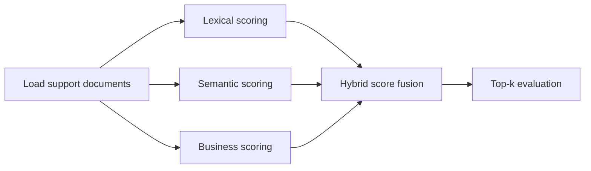

# hybrid-ranking-support-search

## Português

`hybrid-ranking-support-search` é um projeto de busca para suporte que demonstra uma estratégia de **ranking híbrido**: em vez de ordenar documentos com um único critério, o pipeline combina sinais lexicais, sinais semânticos e sinais de negócio em um score final único.

### Storytelling técnico

Em bases de suporte, a pergunta do usuário quase nunca chega “perfeita”. Às vezes ela reutiliza exatamente os termos do artigo certo; em outras, descreve o mesmo problema com outras palavras. Mesmo quando dois documentos parecem semanticamente parecidos, ainda faz diferença saber se aquele conteúdo é mais confiável, mais clicado ou mais prioritário para operação.

É por isso que sistemas reais de retrieval raramente dependem de um único ranking. O desenho mais robusto costuma misturar:

- **ranking lexical** para correspondência exata ou quase exata;
- **ranking semântico** para capturar paráfrases e similaridade de intenção;
- **sinais de negócio** para refletir qualidade operacional da base.

Este projeto implementa exatamente essa lógica em um benchmark pequeno e reproduzível.

### O que é ranking híbrido

Ranking híbrido é a estratégia de combinar múltiplos sinais de relevância para produzir uma ordenação final mais útil. Neste projeto:

- **lexical score** mede proximidade textual entre consulta e documento;
- **semantic score** representa um canal semântico simplificado no fallback local;
- **business score** incorpora qualidade editorial, popularidade e prioridade operacional.

No runtime atual, os canais lexical e semântico usam a mesma base `TF-IDF + cosine similarity`, de forma deliberadamente honesta e reproduzível. Isso deixa o projeto executável sem dependências externas e, ao mesmo tempo, preparado para evoluir para embeddings densos reais.

### Arquitetura do projeto

- [src/sample_data.py](/Users/flaviagaia/Documents/CV_FLAVIA_CODEX/hybrid-ranking-support-search/src/sample_data.py)
  Gera o corpus de documentos e as consultas de avaliação.
- [src/modeling.py](/Users/flaviagaia/Documents/CV_FLAVIA_CODEX/hybrid-ranking-support-search/src/modeling.py)
  Calcula os scores, faz a fusão híbrida e mede `hit_rate_at_1`.
- [main.py](/Users/flaviagaia/Documents/CV_FLAVIA_CODEX/hybrid-ranking-support-search/main.py)
  Executa o pipeline ponta a ponta.
- [tests/test_project.py](/Users/flaviagaia/Documents/CV_FLAVIA_CODEX/hybrid-ranking-support-search/tests/test_project.py)
  Garante o contrato mínimo do benchmark.

### Pipeline



### Estratégia de modelagem

O pipeline executa os seguintes passos:

1. carrega o corpus de documentos de suporte e o conjunto de queries avaliadas;
2. constrói uma representação vetorial com `TfidfVectorizer(ngram_range=(1, 2))`;
3. calcula similaridade por cosseno entre query e documentos;
4. normaliza cada canal de score para a faixa `[0, 1]`;
5. combina os sinais em um score final ponderado;
6. ordena os documentos e mede o acerto do topo do ranking.

### Fórmula do score híbrido

O score final usado no benchmark é:

```text
hybrid_score =
  0.40 * lexical_component +
  0.30 * semantic_component +
  0.15 * quality_component +
  0.10 * click_component +
  0.05 * priority_component
```

Essa composição foi escolhida para refletir a lógica mais comum em sistemas operacionais de busca:

- a relevância textual continua sendo o principal sinal;
- a camada semântica reforça cobertura;
- os sinais de negócio atuam como desempate e calibragem.

### Termos técnicos

- **TF-IDF**: representação vetorial esparsa que pondera termos frequentes no documento, mas menos frequentes no corpus total.
- **Cosine similarity**: medida angular de proximidade entre vetores; muito usada em retrieval.
- **Hit Rate@1**: fração de consultas em que o documento relevante aparece na primeira posição do ranking.
- **Signal fusion**: combinação explícita de diferentes scores em uma única função de ordenação.
- **Business signal**: qualquer atributo não textual que ajude a ordenar melhor o resultado, como qualidade, clique ou prioridade.

### Dataset

O benchmark usa uma base sintética pequena e interpretável:

- `6` documentos de suporte;
- `4` consultas de avaliação;
- documento relevante anotado por consulta.

Arquivos gerados:

- [support_documents.csv](/Users/flaviagaia/Documents/CV_FLAVIA_CODEX/hybrid-ranking-support-search/data/raw/support_documents.csv)
- [evaluation_queries.csv](/Users/flaviagaia/Documents/CV_FLAVIA_CODEX/hybrid-ranking-support-search/data/raw/evaluation_queries.csv)

### Resultados atuais

- `dataset_source = support_search_hybrid_ranking_sample`
- `document_count = 6`
- `query_count = 4`
- `hit_rate_at_1 = 1.0`

Artefatos:

- [hybrid_ranking_results.csv](/Users/flaviagaia/Documents/CV_FLAVIA_CODEX/hybrid-ranking-support-search/data/processed/hybrid_ranking_results.csv)
- [hybrid_ranking_report.json](/Users/flaviagaia/Documents/CV_FLAVIA_CODEX/hybrid-ranking-support-search/data/processed/hybrid_ranking_report.json)

### Interpretação dos resultados

O `hit_rate_at_1 = 1.0` mostra que, no conjunto atual, o pipeline conseguiu colocar o documento relevante na primeira posição em todas as consultas avaliadas. Como o corpus é pequeno e sintético, esse número deve ser lido como uma validação estrutural da estratégia de ranking, não como medida de produção.

### Como evoluir

Os próximos passos naturais seriam:

- substituir o canal semântico por embeddings reais;
- adicionar `BM25` como canal lexical explícito;
- testar `Reciprocal Rank Fusion`;
- introduzir um reranker supervisionado;
- ampliar o benchmark com mais queries e ruído semântico.

## English

`hybrid-ranking-support-search` is a support search project that demonstrates a **hybrid ranking** strategy: instead of ordering documents with a single criterion, the pipeline combines lexical, semantic, and business signals into one final score.

### Technical Storytelling

In support search, user questions rarely arrive in a clean and perfectly aligned way. Sometimes they reuse the exact vocabulary of the best article; sometimes they describe the same issue with different wording. Even when two documents are semantically related, operational signals such as content quality, usage frequency, and business priority still matter.

That is why production retrieval systems rarely rely on a single ranking signal. The most robust setups usually combine:

- **lexical ranking** for exact or near-exact term matching;
- **semantic ranking** for paraphrase and intent similarity;
- **business signals** to reflect operational usefulness.

This project implements that logic in a compact and reproducible benchmark.

### What Hybrid Ranking Means

Hybrid ranking is the strategy of combining multiple relevance signals to produce a better final ordering. In this project:

- **lexical score** measures textual proximity between query and document;
- **semantic score** represents a simplified semantic channel in the local fallback;
- **business score** adds editorial quality, popularity, and operational priority.

In the current runtime, both lexical and semantic channels are implemented with the same `TF-IDF + cosine similarity` stack on purpose. This keeps the project deterministic and executable while remaining easy to upgrade to dense embeddings later.

### Project Structure

- [src/sample_data.py](/Users/flaviagaia/Documents/CV_FLAVIA_CODEX/hybrid-ranking-support-search/src/sample_data.py)
- [src/modeling.py](/Users/flaviagaia/Documents/CV_FLAVIA_CODEX/hybrid-ranking-support-search/src/modeling.py)
- [main.py](/Users/flaviagaia/Documents/CV_FLAVIA_CODEX/hybrid-ranking-support-search/main.py)
- [tests/test_project.py](/Users/flaviagaia/Documents/CV_FLAVIA_CODEX/hybrid-ranking-support-search/tests/test_project.py)

### Scoring Formula

```text
hybrid_score =
  0.40 * lexical_component +
  0.30 * semantic_component +
  0.15 * quality_component +
  0.10 * click_component +
  0.05 * priority_component
```

### Current Results

- `dataset_source = support_search_hybrid_ranking_sample`
- `document_count = 6`
- `query_count = 4`
- `hit_rate_at_1 = 1.0`

Artifacts:

- [hybrid_ranking_results.csv](/Users/flaviagaia/Documents/CV_FLAVIA_CODEX/hybrid-ranking-support-search/data/processed/hybrid_ranking_results.csv)
- [hybrid_ranking_report.json](/Users/flaviagaia/Documents/CV_FLAVIA_CODEX/hybrid-ranking-support-search/data/processed/hybrid_ranking_report.json)
